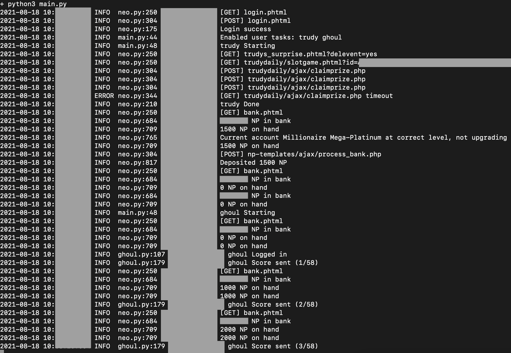

# Auto Neopets

Automate daily tasks on Neopets for multiple accounts while connecting to Neopets through NordVPN.

The aim is to fully automate high neopoints earning daily tasks while remaining undetected by bot detection, by associating each account with a NordVPN IP address and city.

Supported tasks:

- Trudy's surprise
- Collect bank interest
- Auto upgrade bank account to highest available interest rate
- Deposit all NP on hand into bank

Some info redacted for privacy reasons:



## Made with

- [Python](https://www.python.org/downloads/)
- [Docker](https://docs.docker.com/engine/install/ubuntu/)
- Bash

## Requirements

- [Ubuntu 18.04+](https://ubuntu.com/)
- [Docker](https://docs.docker.com/engine/install/ubuntu/)
- [NordVPN paid account](https://nordvpn.com/pricing/)
- Internet connection

## Quick start

1. Compile Docker image

`cd container && ./rebuild-images`

2. Place account passwords in `conf/secret-neopets` in this format:

```
{
    "username_1": {
        "username": "username_1",
        "password": "password_1",
        "city": "Amsterdam", # NordVPN city that is associated with this acc
    },
    "username_2": {
        ...
    },
    ...
}
```

To view the list of available NordVPN cities, first [install the NordVPN CLI](https://sleeplessbeastie.eu/2019/02/04/how-to-use-nordvpn-command-line-utility/) and then run:

```
for i in $(nordvpn countries); do
    nordvpn cities $i
done
```

3. Place NordVPN username and password in `conf/secret-vpn` in this format:

```
VPN_USERNAME="bobby@gmail.com"
VPN_PASSWORD=somePasswordHerePreferablyAlphanumericNoSpecialCharacters29
```

4. Run the Docker image using

```
cd scripts ; ./start
```

NOTE: All traffic on the machine running the Docker container will be routed through whichever NordVPN connection is in use by the Docker container at the time. There is no way around this, as Docker uses the host machine's network to connect to NordVPN.

Logs are stored in `logs/`.

## Acknowledgements

- [MajinClraik/Multi-Tool](https://github.com/MajinClraik/Multi-Tool) - provided the base functions to connect to Neopets and run Trudy / Ghoul Catchers.
